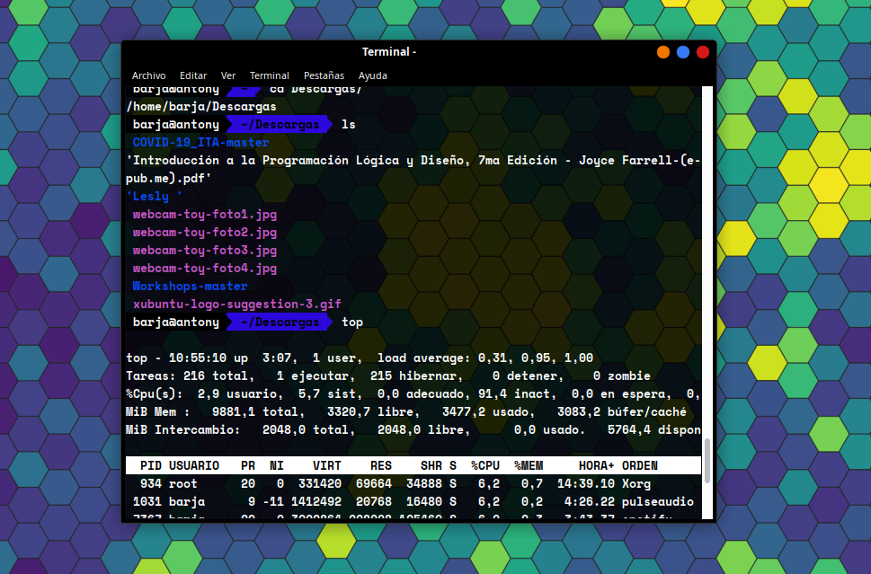

# Introducción al Shell 

**Un shell es un programa cuyo propósito principal es leer comandos y ejecutar otros programas** en sistemas operativos basados en Unix  y similares como por ejemplo GNU/Linux.

El shell de Linux más popular es **Bash**, Bourne Again SHell (llamado así porque se deriva de un shell escrito por Stephen Bourne). Las principales ventajas del shell son su alta relación acción / pulsación de teclas, su soporte para automatizar tareas repetitivas y que puede usarse para acceder a máquinas en red, y sus principales desventajas son su naturaleza principalmente textual y cuán crípticos pueden ser sus comandos y operación.

A incios la curva de aprendizaje puede ser algo complicado pero esto conforme la práctica va ir disminuyendo y podrás manejar de manera eficiente los diferentes arhivos y programas a través de la linea de comandos.

