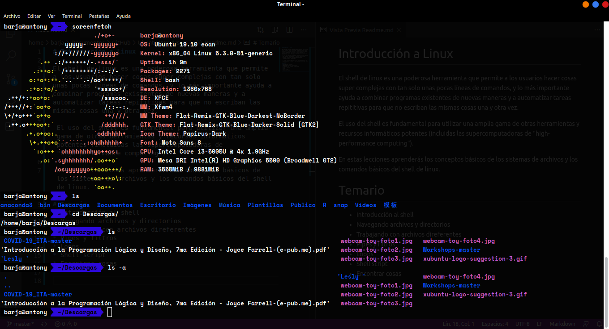

# Introducción a shell de Linux 

El shell de linux es una poderosa herramienta que permite a los usuarios hacer cosas super complejas con tan solo unas pocas líneas de comandos, y lo más importante ayuda a combinar programas existentes de nuevas maneras y a automatizar tareas repititivas para que no escriban las mismas cosas una y otra vez. 

 El uso del shell es fundamental para utilizar una amplia gama de otras herramientas y recursos informáticos potentes (incluidas las supercomputadoras de "high-performance computing").
 
 En estas lecciones aprenderás los conceptos básicos de los sistemas de archivos y los comandos básicos del shell de linux.

# Temario
* Introducción al shell 
* Navegando archivos y directorios
* Trabajando con archivos direferentes 
* Pipes y filtros 
* Loops 
* Shell script
* Encontrar cosas 
  
  Todos los datos producidos en el presente proyecto se publican bajo [licencia Creative Commons (CC BY 4.0 IT)](https://creativecommons.org/share-your-work/): Es posible reproducir, distribuir, transmitir y adaptar libremente datos,  también con fines comerciales, siempre que se cite la **fuente**.